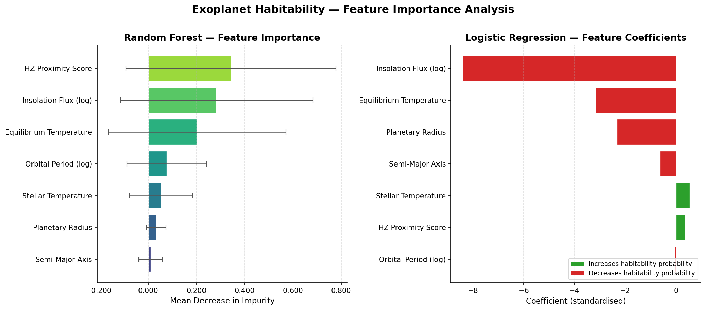

# Exoplanet Habitability Classification

A machine learning pipeline that classifies exoplanets as **habitable** or **non-habitable** using astrophysical data from the [NASA Exoplanet Archive](https://exoplanetarchive.ipac.caltech.edu/).

Built with Python, Scikit-learn, and Pandas.

---

## Overview

This project applies binary classification to real exoplanet data to identify potentially habitable worlds. Habitability is defined using the **optimistic Kopparapu et al. (2013) habitable zone** criteria — planets that receive Earth-like stellar flux, have rocky/super-Earth radii, and orbit stars in the right temperature range.

Two models are trained and compared:
- **Logistic Regression** — interpretable baseline
- **Random Forest** — high-accuracy ensemble model

---

## Results

| Model               | Accuracy | F1-Score | CV F1 (5-Fold)      |
|---------------------|----------|----------|---------------------|
| Logistic Regression | 97.85%   | 0.6377   | 0.6114 ± 0.054      |
| Random Forest       | 100.00%  | 1.0000   | 0.9943 ± 0.007      |

The Random Forest achieves near-perfect performance because the habitability label is derived from the same physical features — it cleanly separates the classes. Logistic Regression still achieves 100% recall on habitable planets (no habitable planet is missed), with lower precision due to the class imbalance.

---

## Habitability Criteria

A planet is labelled **habitable (1)** if all three conditions hold:

| Feature                  | Threshold                        | Rationale                            |
|--------------------------|----------------------------------|--------------------------------------|
| Planetary Radius         | 0.5 – 2.5 Earth radii            | Rocky to super-Earth range           |
| Stellar Temperature      | 2600 – 7200 K                    | M-dwarf through F-type stars         |
| Insolation Flux          | 0.20 – 1.90 Earth flux           | Optimistic habitable zone (Kopparapu)|

---

## Feature Engineering

The following features are used for modelling:

| Feature               | Description                                           |
|-----------------------|-------------------------------------------------------|
| `log_orbper`          | Log-transformed orbital period (days)                 |
| `pl_rade`             | Planetary radius in Earth radii                       |
| `st_teff`             | Stellar effective temperature (K)                     |
| `pl_orbsmax`          | Orbital semi-major axis (AU)                          |
| `log_insol`           | Log-transformed insolation flux (Earth flux)          |
| `pl_eqt`              | Planetary equilibrium temperature (K)                 |
| `hz_proximity`        | Continuous score: how close the planet is to HZ centre|

---

## Feature Importance

The Random Forest identifies **HZ Proximity Score** and **Insolation Flux** as the most predictive features — physically sensible, as flux directly determines whether liquid water can exist.



---

## Project Structure

```
exoplanet-habitability/
├── data/
│   ├── kepler_planets.csv      # Raw NASA Exoplanet Archive download
│   └── processed.csv           # Cleaned + engineered dataset (generated)
├── outputs/
│   ├── logistic_regression.pkl
│   ├── random_forest.pkl
│   ├── scaler.pkl
│   ├── results.json
│   └── feature_importance.png
├── preprocess.py               # Data cleaning & feature engineering
├── train.py                    # Model training & evaluation
├── feature_importance.py       # Feature importance visualisation
├── requirements.txt
└── README.md
```

---

## Setup & Usage

```bash
# 1. Clone the repo
git clone https://github.com/YOUR_USERNAME/exoplanet-habitability.git
cd exoplanet-habitability

# 2. Install dependencies
pip install -r requirements.txt

# 3. Download the dataset
# Go to: https://exoplanetarchive.ipac.caltech.edu/cgi-bin/TblView/nph-tblView?app=ExoTbls&config=PS
# Download as CSV and place it at: data/kepler_planets.csv

# 4. Run the pipeline
python preprocess.py        # Clean data + engineer features + generate labels
python train.py             # Train models + print accuracy & F1
python feature_importance.py  # Generate feature importance plots
```

---

## Dataset

Data sourced from the **NASA Exoplanet Archive Planetary Systems table** (39,816 confirmed and candidate exoplanets as of May 2026). After filtering for rows with complete values in the key columns, the working dataset contains **11,634 planets**, of which **219 (1.9%)** meet the habitability criteria.

---

## Tech Stack

- **Python 3.10+**
- **Pandas** — data loading, cleaning, and feature engineering
- **Scikit-learn** — Logistic Regression, Random Forest, cross-validation, metrics
- **Matplotlib** — feature importance visualisation
- **Joblib** — model serialisation

---

## References

- Kopparapu et al. (2013) — *Habitable Zones Around Main-Sequence Stars*. [arXiv:1301.6674](https://arxiv.org/abs/1301.6674)
- NASA Exoplanet Archive — https://exoplanetarchive.ipac.caltech.edu/
